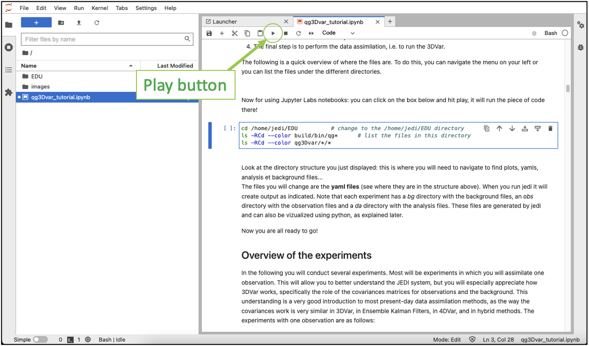

# jedi-edu

This software is licensed under the terms of the Apache Licence Version 2.0 which can be obtained at [http://www.apache.org/licenses/LICENSE-2.0](http://www.apache.org/licenses/LICENSE-2.0).

## Instructions to get started with the jedi-edu tutorials:

### Install docker on your laptop
Scroll down to the bottom of the page: https://docs.docker.com/desktop/
Open docker and wait for it to start.

### Clone the jedi-edu repository
Open a terminal window and clone the jedi-edu repository.
```
git clone https://github.com/JCSDA-internal/jedi-edu.git
```
Checkout the qg_tutorial branch:
```
cd jedi-edu
git checkout qg_tutorial
```

### Build and enter the container
```
cd container
docker build -t educontainer --build-arg=Dockerfile .
docker run -it --rm -p 9999:8888 -v <your>/<path>/<to>/jedi-edu/notebooks/:/home/jedi/ educontainer
```

You will see a message resembling:
```
check start

Welcome to JEDI Tutorial!  To connect, open your browser to:
	 localhost:<port>

NOTE: Replace '<port>' with the port you specified in your 'docker run' command. For example, if you used the option:
	        -p 9999:8888

Then you should open the browser and go to:
	 localhost:9999
```

Open your favorite browser and go to `localhost:9999`
All that follows is done **in the container ON THE WEBPAGE you just opened**.

### Clone and build oops-bundle
In the launcher sub-window, click on `terminal`.


Enter the following commands in your web terminal:
```
cd EDU
git config --global credential.helper "cache --timeout=3600"
git clone https://github.com/JCSDA-internal/oops-bundle.git
cd build
ecbuild ../oops-bundle
make -j4
```
You should not need the terminal sub-window after this.

### Open the qg 3dvar tutorial
On the left of the web page there is a tree of files, click on the little folder icon if you aren't on it already, and double click on `qg3Dvar_tutorial.ipynb`.

Note that in this file, you will be able to run commands by clicking on the cell that contains it and click the `play` button.


### Follow the tutorial instructions!
